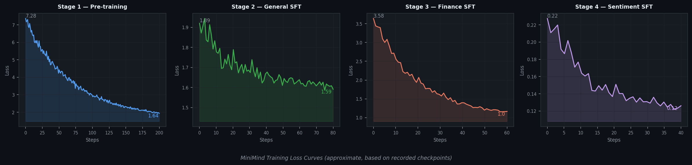

# MiniMind LLM Fine-tuning — Finance & Sentiment Analysis
# MiniMind 大语言模型微调 — 财务问答与情感分析

An independent end-to-end LLM training experiment based on the [MiniMind](https://github.com/jingyaogong/minimind) open-source project, covering the full pipeline from pre-training to domain fine-tuning and quantitative evaluation.

基于开源项目 [MiniMind](https://github.com/jingyaogong/minimind) 的独立端到端 LLM 训练实验，覆盖从预训练到领域微调、定量评估的完整流程。

---

## Project Overview / 项目概览

| Item / 项目 | Details / 详情 |
|-------------|----------------|
| Base project / 基础项目 | [MiniMind](https://github.com/jingyaogong/minimind) by jingyaogong |
| Model size / 模型规模 | 63.9M parameters (hidden_size=768, num_hidden_layers=8) |
| Hardware / 硬件 | AutoDL RTX 4090D，单卡 |
| Framework / 框架 | PyTorch 2.1 / Transformers 4.47.0 / CUDA 12.1 / Python 3.10 |
| Inference speed / 推理速度 | 105–200 tokens/s |

---

## Training Pipeline / 训练流程

```
Pre-training → General SFT → Finance Fine-tuning → Sentiment Classification Fine-tuning
预训练       → 通用 SFT   → 财务领域微调         → 情感分析分类微调
```

### Stage 1 — Pre-training / 预训练

| Item | Details |
|------|---------|
| Dataset / 数据集 | pretrain_t2t.jsonl — 840万条样本，7.8GB |
| Epochs | 2 |
| Loss | 7.28 → 1.64 |
| Duration / 时长 | ~15 小时 |
| Output / 输出权重 | pretrain_768.pth |

### Stage 2 — General SFT / 通用指令微调

| Item | Details |
|------|---------|
| Dataset / 数据集 | sft_t2t_mini.jsonl — 895,718 条指令对话样本，1.7GB |
| Epochs | 2 |
| Loss | 1.89 → 1.59 |
| Duration / 时长 | ~3 小时 |
| Output / 输出权重 | full_sft_768.pth |

### Stage 3 — Finance Domain Fine-tuning / 财务领域微调

| Item | Details |
|------|---------|
| Dataset / 数据集 | sft_finance_v2.jsonl — 75 条财务问答，自行设计 |
| Coverage / 覆盖模块 | 13 个模块：三张报表、比率分析、DCF、LBO、WACC、FP&A、Variance Analysis、行业指标、财务陷阱、计算题等 |
| Epochs | 20 |
| Learning rate | 2e-5 |
| Loss | 3.58 → 1.00 |
| Output / 输出权重 | finance_sft_768.pth |

数据集分两层设计 / Dataset designed in two tiers:
- **基础层 Foundational**（面向零基础用户）：概念定义 + 生活比喻，无术语负担
- **进阶层 Advanced**（面向金融从业者）：公式 + 计算逻辑 + 实务应用

### Stage 4 — Sentiment Classification Fine-tuning / 情感分析分类微调

| Item | Details |
|------|---------|
| Dataset / 数据集 | Financial PhraseBank（via ModelScope: modelgod2025/financial_phrasebank_50agree）|
| Task / 任务 | 英文金融新闻句子 → positive / negative / neutral |
| Samples / 样本数 | 4,846 条标注句子（≥50% 标注者一致）|
| Epochs | 5 |
| Learning rate | 1e-5 |
| Loss | 0.22 → 0.12 |
| Duration / 时长 | ~4 分钟 |
| Output / 输出权重 | sentiment_sft_768.pth |

---

## Training Loss Curves / 训练 Loss 曲线



> *Approximate curves based on recorded checkpoint loss values*

## Evaluation Results / 评估结果 — Sentiment Classification

评估采用分层随机抽样（每类各 50 条，共 150 条），以修正数据集类别不平衡问题。

Evaluation used stratified random sampling (50 samples per class, 150 total) to correct for class imbalance.

> **注 / Note：** 顺序取样时前 200 条中 negative 仅 1 条，accuracy 虚高至 74%。改用分层抽样后得到真实指标。
> Sequential sampling produced inflated accuracy (74%) — negative had only 1 sample in first 200 rows. Stratified sampling was used to obtain honest per-class metrics.

| Metric / 指标 | Score / 结果 |
|---------------|-------------|
| **Accuracy / 准确率** | **82.7%** |
| **Macro F1** | **81.8%** |

| Class / 类别 | Precision | Recall | F1 | Support |
|--------------|-----------|--------|----|---------|
| negative | 0.92 | 0.92 | 0.92 | 50 |
| neutral | 0.70 | 1.00 | 0.83 | 50 |
| positive | 0.97 | 0.56 | 0.71 | 50 |

**分析 / Observations:**
- `negative` 识别最稳，precision 和 recall 均达 0.92 / Most stable class, both metrics at 0.92
- `neutral` 召回率满分，但 precision 偏低，模型有过度预测 neutral 的倾向 / Perfect recall but lower precision — model over-predicts neutral
- `positive` 精确率高但召回率偏低，主要因训练数据中 neutral 占比最高（约 59%），模型对正面情感偏保守 / High precision but low recall — likely due to neutral being the majority class (~59%) in training data

参考基准 / Baseline reference：FinBERT 在 Financial PhraseBank 上准确率约 90%+。本模型为 63.9M 参数中文预训练模型，英文金融 NLP 表现低于 FinBERT 属正常预期。

---

## Key Scripts / 核心脚本

| Script / 脚本 | Description / 说明 |
|---------------|--------------------|
| `gen_finance_sft_v2.py` | 生成财务问答数据集 sft_finance_v2.jsonl / Generates finance QA dataset |
| `gen_sentiment_sft.py` | 从 ModelScope 下载 Financial PhraseBank 并转换为 SFT 格式 / Downloads and converts Financial PhraseBank |
| `eval_sentiment.py` | 分层抽样评估情感模型，输出 accuracy、macro F1、分类报告 / Evaluates sentiment model with stratified sampling |
| `minimind_demo.py` | Streamlit Demo — 双模型对比 + 情感分析模块 / Dual model comparison + sentiment analysis |
| `trainer/train_full_sft.py` | SFT 及微调训练脚本 / SFT and fine-tuning training script |
| `eval_llm.py` | 交互式推理脚本 / Interactive inference script |

---

## Interactive Demo / 交互式演示

使用 Streamlit 构建，Windows XP 经典风格，中英双语界面。

Built with Streamlit — Windows XP classic UI style, bilingual (EN/ZH).

**功能 / Features:**
- 8 个预设财务问题，点击直接填入 / 8 preset finance questions, click to fill
- 左右双栏对比 `full_sft` vs `finance_sft` 回答 / Side-by-side model comparison
- 情感分析模块：输入英文金融新闻句子 → 输出 🟢 POSITIVE / 🔴 NEGATIVE / 🟡 NEUTRAL

**启动方式 / To run:**
```bash
cd /root/minimind
streamlit run minimind_demo.py --server.port 6006 --server.address 0.0.0.0
```

---

## Checkpoint Management / 权重文件管理

**重要教训 / Key lesson：** 每次微调前必须用 `--save_weight` 指定新文件名，绝不覆盖 `full_sft_768.pth`。早期一次财务微调未指定保存路径，直接覆盖了通用 SFT 权重，导致模型通用能力退化，恢复花费约 3 小时重新训练。

Always specify `--save_weight` with a new filename before fine-tuning. An early run overwrote `full_sft_768.pth`, causing general capability degradation — recovery required re-running general SFT (~3 hours).

```bash
# 正确做法 / Correct approach
python train_full_sft.py \
    --from_weight full_sft \
    --save_weight finance_sft \   # 始终另存新文件 / always write to a new file
    ...
```

| Checkpoint | Description / 说明 |
|------------|--------------------|
| pretrain_768.pth | 预训练权重，勿覆盖 / Pre-training weights — do not overwrite |
| full_sft_768.pth | 通用 SFT 权重，所有微调起点，勿覆盖 / General SFT — starting point for all fine-tuning |
| full_sft_768_backup.pth | 通用 SFT 备份 / Backup |
| finance_sft_768.pth | 财务微调 v2（75条，ep20）/ Finance fine-tuning v2 |
| sentiment_sft_768.pth | 情感分析微调（4,846条，ep5）/ Sentiment classification fine-tuning |

---

## Environment / 环境依赖

```
Python        3.10
PyTorch       2.1.0
Transformers  4.47.0
tokenizers    0.21.0
CUDA          12.1
modelscope    1.30.0
streamlit     (latest)
scikit-learn  (for evaluation / 用于评估)
addict        (modelscope dependency / modelscope 依赖)
```

```bash
pip install addict -q   # 若 modelscope 报错时补装 / install if modelscope throws ModuleNotFoundError
```

---

## Disclaimer / 免责声明

本项目为基于 [MiniMind](https://github.com/jingyaogong/minimind) 开源项目的独立复现与实验，不包含任何模型研究贡献或架构创新，目的是通过实践理解 LLM 完整训练流程。

This project is an independent replication and experimentation exercise based on the [MiniMind](https://github.com/jingyaogong/minimind) open-source project. It does not claim any model research contribution or architectural innovation. The purpose is to gain hands-on understanding of the full LLM training pipeline.
